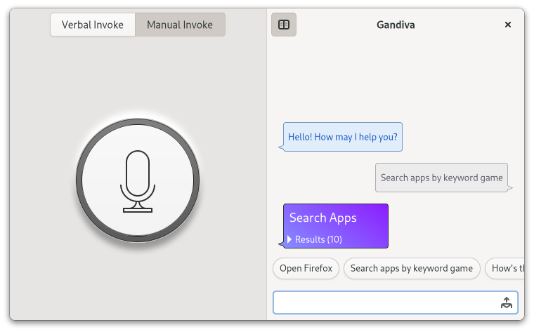

<div align="center">


# Gandiva



## Virtual AI Companion

Gandiva is the codename for an opensource virtual assistant program for Linux based operating systems. It's a voice activated accessibility tool, which is designed to simply general computing operations. It's built using python and Gtk.

https://youtu.be/H2z6n-_uqG0

[](https://youtu.be/H2z6n-_uqG0)

</div>

<br>

### Main Features:
- Easy and fast file system search
- Easy and fast app search and launch apps and actions from within the app
- Talk to the program directly using voice
- Summon the program by calling "Hey Gandiva!"
- Ask questions about your computer (only Gnome and Pantheon desktops supported) [Not yet available]
- Ask trivia questions
- Control your PC using voice (only Gnome and Pantheon desktops supported) [Not yet available]
- Have basic conversation with the program [Partially available]
- Communicate with other apps via DBUS [Not yet available]
- A mandatory weather skill

<br>

### Download from AUR, Flathub and elementary OS AppCenter:

Not yet available.

--------------------------------------------------------------------------------

### Getting started:
**1) INSTALL FROM SOURCE**

You can install Gandiva from source by compiling from source. For that you will need the following:

PROGRAMMING LANGUAGES:
- `python3`
- `c`

PACKAGE UTILITIES:
- `pip3`
- `wheel`

BUILD SYSTEM:
- `meson`
- `cmake` (Required by meson)

PYTHON DEPENDENCIES:
- `pygobject`
- `numpy`
- `nltk`
- `vosk`
- `pyalsaaudio`
- `pillow`
- `py-espeak-ng`
- `geocoder`

C DEPENDENCIES:
- `python3` (C library for python 3)
- `gtk4`
- `glib-2.0`
- `libadwaita`
- `alsa`
- `pcaudiolib`
- `espeak-ng`

Once you have these, you can build it using the following commands:
```
meson _build --prefix=/usr
sudo ninja -C _build install
com.github.watsonprojects.gandiva
```

Alternatively, you can build it using <i>Flatpak</i>. For that you will need the following:

- `flatpak`
- `flatpak-builder`

Download the [elementary OS Flatpak Repo](https://flatpak.elementary.io)
and add it using

```sudo flatpak remote-add repo.flatpakrepo --if-not-exists https://flatpak.elementary.io/repo.flatpakrepo```

[Where `repo.flatpakrepo` is the file you downloaded]

FLATPAK RUNTIME AND SDK:
- `io.elementary.Platform >= 7`
- `io.elementary.Sdk >= 7`

Once you have these, you can install using the following commands:
```
flatpak-builder build  com.github.watsonprojects.gandiva.yml --user --install --force-clean
flatpak run com.github.watsonprojects.gandiva
```

**2) LAUNCHING THE APP**

Once installed you can find the app in your applications menu.
Start the app from there. On first start, you will be greeted with an initial setup screen. Set the permissions you need and you are set.

Once the app is started, it can run in background. You can always summon it using the hot word 'Hey Gandiva!'. It can take voice input and also text input using the chatbox. If Voice activation is enabled then closing the app merely puts it to sleep and it's continuously listening for hot word. Saying the hot word will bring it back up.

**3) ASKING QUESTIONS**

You can type any question in the chatbox to the right or click the mic button and speak your question. The app will answer your question or do
something that you have asked it to do. If you are not sure what to ask, there are question suggestions displayed right above the chat textbox.
You can click them to insert the suggestions in chat and send them right away.

The answer to your questions come from specific skills. Different skills handle your question in different manners. They may or may not reply using specialized speech bubbles, often containing additional information about the result or even interactable elements.

You might also notice that when you start typing the usual suggestions are replaced with files and apps on your computer. These will be discussed below.

**4) FILE SEARCH**

You can type file or folder names in the chat textbox and it will show some suggestions based on best matches. You can click on them to directly open the file or folder. You can also ask Gandiva to search for files or folders by name and the app will present you a speech bubble with all the files that match. You can also tell Gandiva to open specific libraries which are special folders for specific kind of files. For example, you ask it to open the music library and it will open the main music folder in your home folder. These libraries are opened based on XDG special user folder specification.

For file search to work in the first place the files must need to be indexed. Due to time considerations the app doesn't automatically index files yet. To index files, type in `system run index`. The process may take a long time depending on your harddrive speed and number of files. It only indexes files in the home directory (based on XDG_HOME specification)

**5) APP SEARCH** (Doesn't work in Flatpak yet)

You can similarly type in an app's name or the type of app you are looking for and Gandiva will show you suggestions based on that. You can click the suggestions to directly launch the app. You can also ask Gandiva to search apps by name, keyword or by app category. It will show you a list of apps and their supported actions, which you can directly trigger from within the app. You can also tell the app to open an app directly upon which it will open the app which best matches the name you have given.

**6) SKILLS**

For the app to work, it needs skill plugins which are loaded dynamically from the user data folder at launch. To reload and update skills manually, type in `system run relearn`.

Skills and the ones that come out of box are going to be further discussed in details below.


--------------------------------------------------------------------------------

### Project Files

In this section, we discuss all the files present the project folder briefly. To know more about the files, check the docstrings within the files. There are docstrings for every file, class and most functions.

[All files are licensed under **GNU GPLv3**]

[I have also used a program called `pylint` for making sure the python files are as well styled and as readable as possible. You may see some pylint override comments in some of the python files.]

[The `__init__.py` files are present under every module, there's nothing in them, but they help with identifying those folders as separate modules]


- **README.md** ▶
This file

- **meson.build** ▶
It's the main build script for natvely building the app from source. This script installs the app, it's resources like stylesheet, images, skills, speech recognition models, etc.

- **com.github.watsonprojects.gandiva.yml** ▶
It's the flatpak manifest file written in _YAML_. It's used for building the application using flatpak builder or in future be used by flatpak distribution systems like _Flathub_ and _elementary OS AppCenter_. It basically contains instructions to setup the flatpak sandbox for the app and install all the dependencies and then the app in it.

- **.gitignore** ▶
Excludes certain files and folders from being tracked by the git version control system

- **<u>src</u>** ▶
Folder containing all the python code of the app. Doesn't contain the skills which are also python files.

    - **gandiva.in** ▶
This is the main python executable file of this app and usually goes in the `bin` folder after being renamed by meson to `com.github.subhadeep.gandiva`. Meson basically renames it, substitutes certain tokens with actual values which are constants and puts it in the `bin` folder with execute permissions. This can be later used for translations. (Currently translations are not set up)

    - **main.py** ▶
This file has the main Application class which is derived from `Adw.Application` which is in turn derived from `Gtk.Application`. It instantiates the two parts of the applications namely _core-loop_ and _shell_ and help them exchange data while they are running in their own threads. The core loop has it's own thread and has the functional components of the application while the shell which has the GTK main loop and has the UI.

    - **meson.py** ▶
It's a script file which is used by the main meson build script. This lists all the sources files within the `src` folder. This also sets the configuration data which substitutes the configuration tokens inside `gandiva.in` file. The configuration tokens are `@app_id@`, `@pkgdatadir@` and `@version_string@`.

    - **<u>config</u>** ▶
This folder has a file for the constants and another for settings which are accessible throughout the app

        - **constants.py** ▶
This file has constants to be accessible throughout the code base. All the constants are defined as `global`. However, the function `init()` needs to be called in order to initialize them, before any of these constants are accessed.

        - **settings.py** ▶
This file has all the settings functions. These are not constants, they are variables that are saved even after the app is closed. Before using any of the functions, the `init()` function must be called to initialize the `Gio.Settings` object using the app's RDNN.

    - **<u>core</u>** ▶
This folder has all core functionality of the app. The core loop, inference system, skill system, speech-to-text and text-to-speech are all housed here.

        - **core_loop.py** ▶
This implements the main AI loop, which consists of listening for input, processing it (act on it), when input is available, sending some response back to the user and going back to listening and so on…

        - **inference_engine.py** ▶
This is the *brain* of the app. This is where we take the query from the user, match it against a couple of skills in the database, run a function that was defined by the skill to handle the query and send back the result to the core loop.

        - **skill_backend.py** ▶
This file has the skill backend, skill class and intent class. Skill backend takes care of registering intents that are supplied by skills and their intent handlers. Intent handlers are callbacks which can be later used to perform some action based on the user's "intent" as determined from user's question. The `Skill` class is inherited by the skills, which gives them access to the `register_intent()` function, which is then called by the skill to register itself in the skill database of Gandiva. `Intent` refers structure representing user's intention as derived from the natural language input given by the user. More info in the class docstrings.

        - **system_portal.py** ▶
This file has a SystemPortal class which has functions that the skills can use for various operations like, fetching data from the internet, finding location, etc. It all goes through one central place.

        - **tts.py** ▶
This code implements the text-to-speech system using _epeak NG_. There's plans to later on change that to a custom text-to-speech solution built just for this project.

        - **stt.py** ▶
Here we have implemented the speech-to-text system using _vosk_.

        - **wake_word_engine.py** ▶
This code implements the wakeword engine which continuosly listens for a wakeword or hot word.Wake word currently set is _"Hey Gandiva"_.

        - **file_system_search.py** ▶
This file has code to index file and folder found in the `home` directory which is given by `HOME` environment variable, and provide a fast search capability.

        - **app_search.py** ▶
This code implements an app search and quick launch functionality. Apps are loaded into memory as a list of `DesktopApplication` objects, which has most of the useful information about the app which can be used to launching them or trigerring actions.

    - **<u>shell</u>** ▶
This folder has all the code related to the UI of the app.

        - **main_window.py** ▶
This code file contains the Main UI logic .The class MainWindow forms the well, main window of the app. Everything else renders within it.

        - **chat_view.py** ▶
This code implements the chat interface using which the user can interact with the AI. The user can type in the questions in a textbox and press enter or the send button. When the app window is small enough and the "face" (explained below) of the app is not visible, the textbox also shows a mic icon to trigger listening mode. In that case there is also a show face button to show the face panel. There's a suggestion panel above the main textbox and the conversation appears in the panel above it in a similar style as any other instant messaging app.

        - **face_view.py** ▶
This file implements a main "face" button which acts as a way to "wake" Gandiva (switch to lisetning mode), stop listening, or even stop talking and also provides a memetic visual interface for the user to gauge the AI system. It also has two buttons to switch between voice activation or manual activation (clicking the big mic button). The "face" gives the app it's signature appearance. It has a "looking around" animation and occational blinking animation. The face is planned to be animated as human like as possible with several emotions. This gives the feeling of talking to a virtual character and make it much more welcoming.

        - **initial_setup.py** ▶
This file implements an initial setup page which is displayed if the app is opened for the first time. The setup provides an interface to let the users know of the various features of the app and the permissions needed using a slideshow or carousel.

        - **chat_bubble.py** ▶
The file contains code for implementing the speech bubbles which appear in the chat view. The speech bubbles can be simple text bubbles or complex widgets with interactive elements.

        - **suggestion_button** ▶
This code implements the suggestion buttons which appear right over the chat textbox. These buttons can just insert text in the chat or even trigger certain actions like launching apps or opening files and folders.

        - **toast_widget.py** ▶
The toast widget is a temporary replacement for the Adw.Toast widget. The toast shows a message box at the top of the app optionally with an action button which allows the user to take a certain action directly from the toast.

    - **<u>utils</u>** ▶
This folder contains elementary utility functionalities which are used in various places in the app.

        - **utilities.py** ▶
Utilities used by various modules of the app. Usually contains classes and functions that are common used but I couldn't find a better place to have them in.

- **<u>data</u>** ▶
This folder contains all the additional data or resources that the app uses like images, sounds, manifests, schemas, stylesheet, etc.

    - **<u>images</u>** ▶
This folder contains various kinds of images used in the app UI.

        - **<u>callout_gfx</u>** ▶
This folder contains SVGs used for the little "callout" spikes on the sides of speech bubbles. That's what makes them "speech bubbles".

            - **left.svg** ▶
Callout spike to be shown on the left of speech bubbles

            - **right.svg** ▶
Callout spike to be shown on the right of speech bubbles

        - **<u>icons</u>** ▶
This folder contains various SVG icons used in the UI and for the `.desktop` entries which allow the app icon to be shown in the application menu of most Desktop Environments. The sub folders house icons of various resolutions. This ensures that the icon looks good in all sizes.

    - **<u>SpeechRecognitionModels</u>** ▶
This folder contains folders of speech recognition models used by the app. These are not code written by me. The one that's in there is a smaller VOSK en-us model prepared by _librispeech_.

    - **<u>SkillPlugins</u>** ▶
This folder contains various skills as mentioned above. [**IMPORTANT:** Skill folders always have the same structure which is that the folder name is the name of the skill (module name). Inside, there will always be one `__init__.py` file with a class with name `<skill name>Skill`. So, if I want to make a skill "FooBar", then I will make folder named "FooBar" and inside it a `__init__.py` file with a class "FooBarSkill".]

        - **<u>DateTime</u>** ▶
Skill folder for DateTime skill.

            - **__init__.py** ▶
Python file implementing the DateTimeSkill class. This skill allows the app to respond to the user with the current time or date.

        - **<u>DuckDuckGo</u>** ▶
Skill folder for DuckDuckGo skill.

            - **__init__.py** ▶
Python file implementing this skill. This skill allows Gandiva to answer certain trivia questions from the user. It also acts as a fallback skill which is used when all other likely intents handlers have failed. It utilizes the DuckDuckGo answering API.

        - **<u>OpenWeatherMap</u>** ▶
Skill folder for OpenWeatherMap skill.

            - **__init__.py** ▶
Python file implementing this skill. This skill allows Gandiva to fetch weather information of the current location, using the OpenWeatherMap API.

            - **<u>images</u>** ▶
This folder contains images representing various weather conditions to act as background art for the weather speech bubble UI.

        - **<u>Personality</u>** ▶
Skill folder for Personality skill.

            - **__init__.py** ▶
This skill gives Gandiva a "personality". It allows Gandiva to respond to certain personal questions directed towards Gandiva. It has a couple of intent handlers. Many more will be added in future.

        - **<u>Wikipedia</u>** ▶
Folder for Wikipedia skill.

            - **__init__.py** ▶
This skill allows Gandiva to fetch information from Wikipedia when specifically asked to do so. The reponse speech bubble will often have multiple possible Wikipedia page references with a link to open the corresponding page in the default browser.

        - **<u>AppSearch</u>** ▶
Skill folder for AppSearch skill.

            - **__init__.py** ▶
This is an internal skill which allows Gandiva to search for apps based on name, keyword or category and to also launch apps directly with a single command. The output is a speech bubble with an app or list of apps and their actions. [**IMPORTANT:** Internal skills have special permissions which normal skills don't have, which is often adding an _intent_ for an already existing funtion of the app. The skill backend only allows specific intent handlers to access such functionalities. If any other skill tries to access them, Gandiva will block it and warn the user. Anything that normal skills need to access can be found in the system portal]

        - **<u>FileSystemSearch</u>** ▶
Skill folder for FileSystemSearch skill.

            - **__init__.py** ▶
This is also an internal skill which allows Gandiva to search for files and folders based on the name or keyword. It also allows Gandiva to open specific libraries or special user folders as per _XDG Directory Specification_. The output is a speechbubble with a list of files and folder with buttons to open them using the default file manager of the OS.

    - **<u>Dictionaries</u>** ▶
Left-over folder from when I was trying to use pocketsphinx for wakeword detection. This might be useful in future.

    - **application.css** ▶
This is the main stylesheet of the app.

    - **com.github.watsonprojects.gandiva.desktop** ▶
This is the desktop manifest (launcher) file which usually goes inside `/usr/share/applications` and adds an entry in the applications menu of the Desktop Environment. It defines the application name by which the DE identifies the app in the DE UI, a common name, description, keywords which help with application menu search, category under which this app falls and an icon for the app.

    - **com.github.watsonprojects.gandiva.gschema** ▶
This is the GSettings schema (xml) file which defines settings that are used by this app and retained after the app has been closed.

    - **meson.build** ▶
Meson script for installing these files in the `data` folder in their respective locations defined in the script.

- **<u>screenshots</u>** ▶
Contains pretty pictures of the app.
